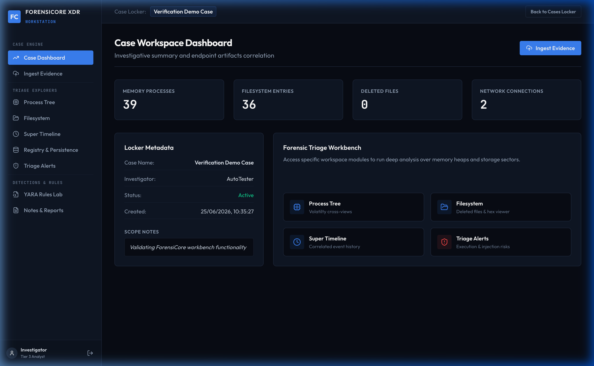
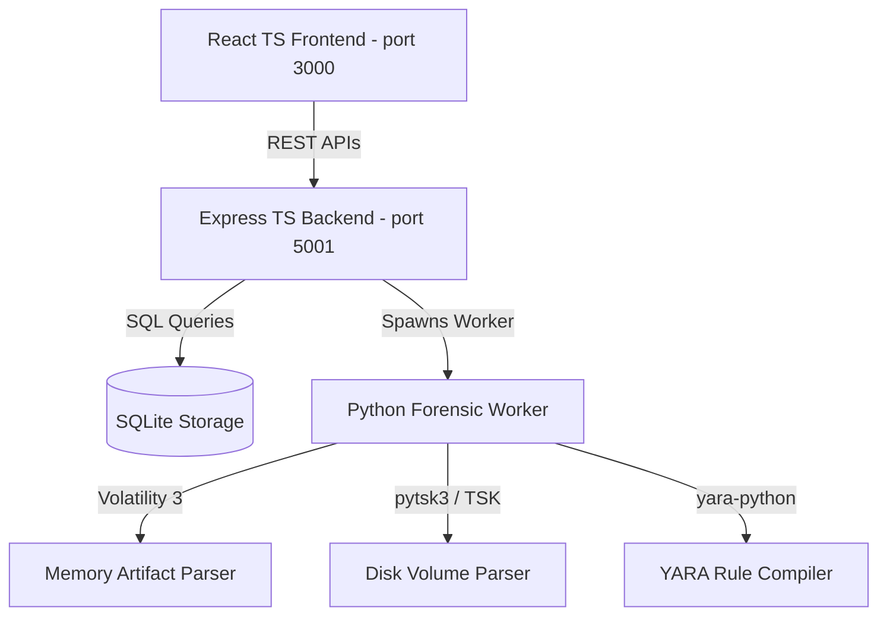

# ForensiCore XDR Forensics Workbench

A professional, full-stack digital forensics and incident response (DFIR) workstation platform. ForensiCore correlates host memory dumps, SleuthKit disk image volumes, registry hives, network sockets, event logs, browser logs, and custom YARA rules into a single visual investigation interface.

[
](https://jithun02.github.io/disk-rcorrelation/)
---https://jithun02.github.io/disk-rcorrelation/

## Key Capabilities

*   **Modular Ingestion Pipeline**: Ingest raw memory dumps (`.mem`, `.raw`) and SleuthKit disk volumes (`.001`, `.dd`, `.img`) with automated SHA-256 integrity verification.
*   **Volatile Cross-View Correlation**: Automatically cross-references Volatility 3 `pslist`, `psscan`, and `psxview` checks to flag stealthy, hidden process structures.
*   **Interactive Filesystem Explorer**: Navigate partition directories, filter deleted file entries, verify file hashes, inspect YARA hit signatures, and view binary structures using the **Hex & Strings sector reader**.
*   **Chronological Super Timeline**: Build a unified chronological timeline mapping process execution timings, filesystem modifications (MACB), browser downloads, and socket connections.
*   **Persistence & Settings Auditor**: Audit AutoRun registry hives, startup keys, Windows services, browser download logs, and persistence vectors.
*   **Analyst Report Center**: Log investigation notes and export complete standalone compliance reports as standalone HTML.
*   **Double-Execution Modes**:
    1.  **Live Mode**: Spawns host Python scripts triggering `pytsk3` and `volatility3` bindings.
    2.  **Simulation Mode**: Simulates complex threat cases (useful for static presentations, client-side demos, or offline review).

---

## Architectural Workflow



---

## Codebase Modules

```text
diskimage/
├─ package.json                      # Concurrently starts API and Web apps
├─ requirements.txt                  # Python dependencies
├─ core_forensics/                   # Forensic parsers (Volatility & pytsk3 bindings)
│  ├─ worker.py                      # Orchestrator running live parses or simulations
│  ├─ memory/                        # Volatility 3 plugins wrappers
│  ├─ disk/                          # pytsk3 volume recursively scanner
│  └─ core/                          # Correlation rules & timeline builder
├─ apps/
│  ├─ api/                           # Node.js + Express TypeScript API Backend
│  │  ├─ src/
│  │  │  ├─ db.ts                    # SQLite database tables migration schemas
│  │  │  ├─ server.ts                # Express REST API routes & child_process orchestrator
│  │  │  └─ index.ts                # Boots server on port 5001
│  ├─ web/                           # Vite + React + TypeScript + Tailwind CSS Frontend
│  │  ├─ src/
│  │  │  ├─ components/              # Explorers (Process Tree, Filesystem, Hex reader)
│  │  │  └─ App.tsx                  # Dashboard layout shell and static client fallbacks
```

---

## Quick Start Setup

### 1. Prerequisites
Ensure you have the following installed on your system:
*   Node.js (v18 or higher)
*   Python 3.10+
*   SleuthKit (for pytsk3 disk volume parsing)

### 2. Installation
Clone the repository and install all dependencies:
```bash
# Install Node.js backend & frontend dependencies
npm run install:all

# Create virtual environment and install python dependencies
python3 -m venv .venv
source .venv/bin/activate
pip install -r requirements.txt
```

### 3. Execution

#### Live Database-Backed Mode (Local)
To start both the backend Express server (port 5001) and frontend Vite server (port 3000) concurrently:
```bash
npm run dev
```
Open **`http://localhost:3000/`** in your browser. Create a new case and trigger an evidence file ingestion.

#### Static Demo Mode (GitHub Pages)
The web client includes a built-in static fallback mode. When hosted on GitHub Pages or run without an API backend, it automatically simulates all case operations and processes evidence purely in-memory in your browser.
